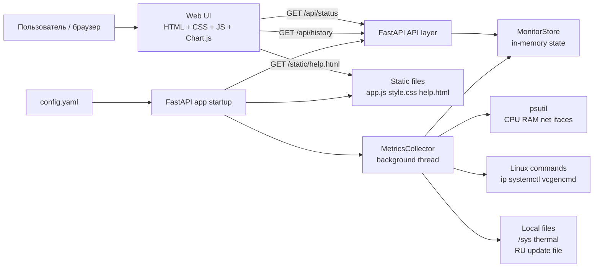
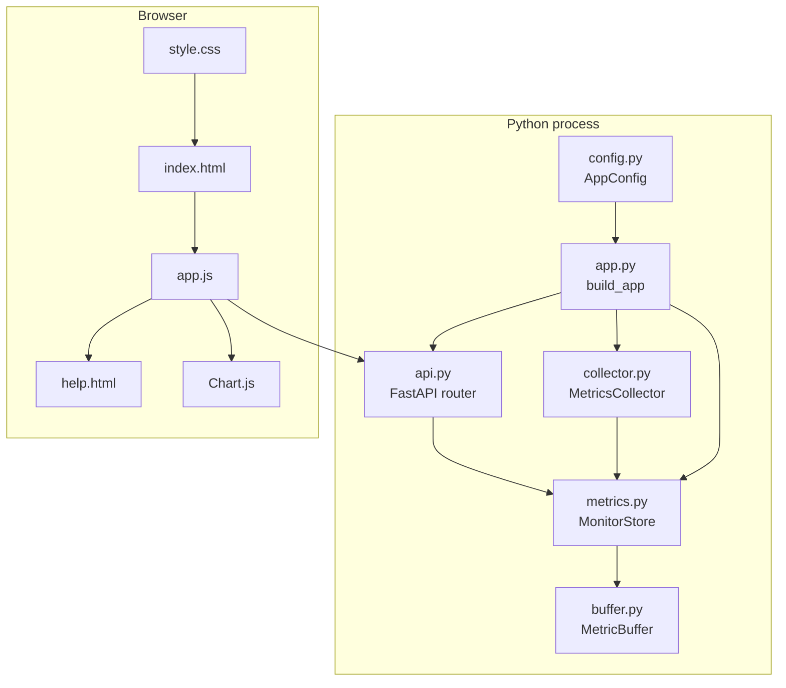
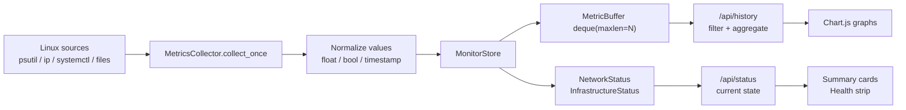
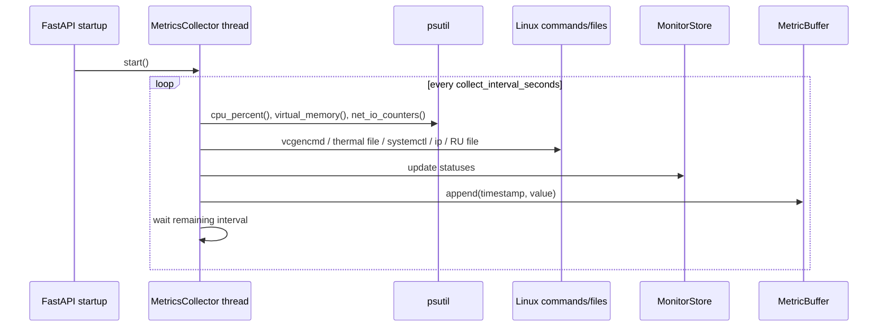
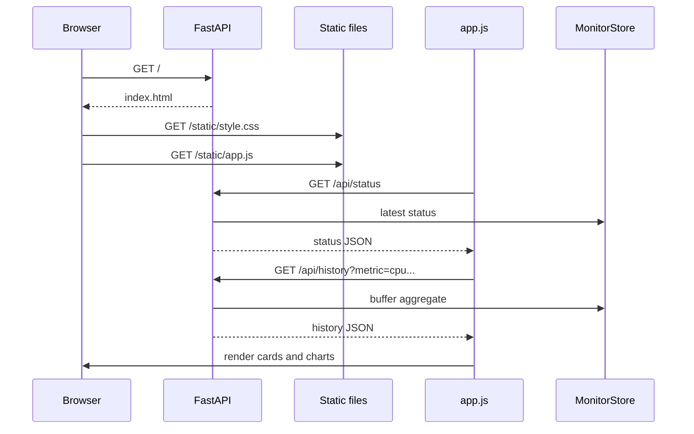
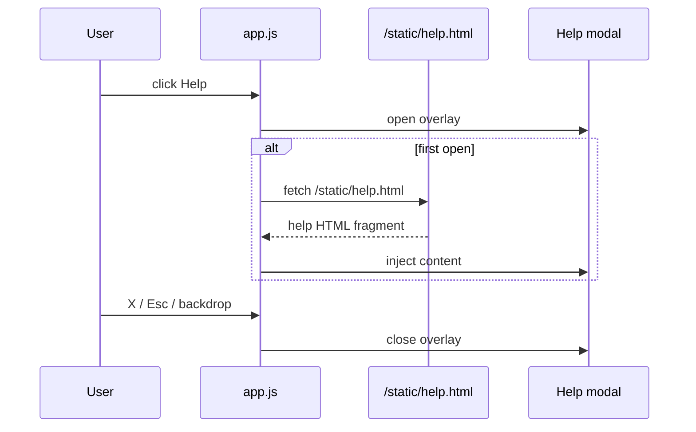
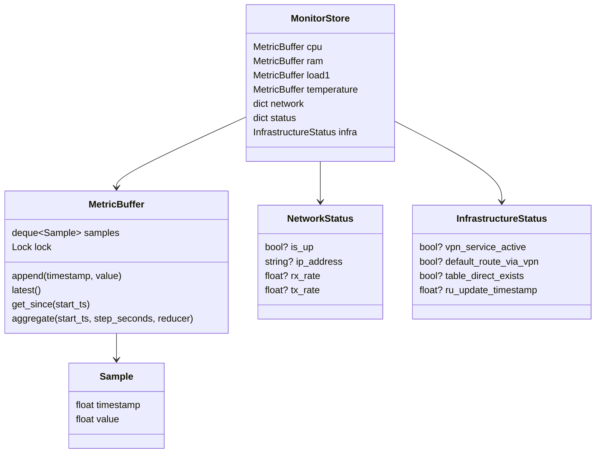
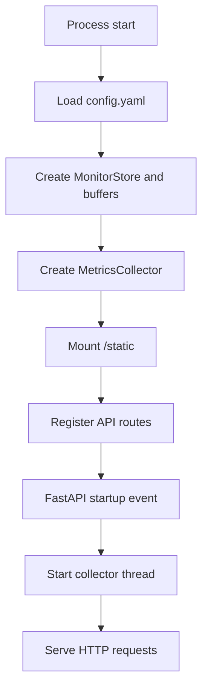

# Архитектурная и техническая документация Strat-tools Server Monitor

## 1. Обзор системы

Strat-tools Server Monitor — локальная система оперативного мониторинга Linux/Raspberry Pi узла, который выполняет роль gateway/router, VPN endpoint, split-routing узла или другого инфраструктурного сервера.

Система предназначена для ежедневного наблюдения за состоянием узла через web dashboard `Gateway Telemetry`. Она собирает системные, сетевые и инфраструктурные показатели, хранит недавнюю историю только в памяти процесса и предоставляет данные через HTTP API для отображения графиков и статусов.

### Основные задачи

- Показать, жив ли сервер и отвечает ли web dashboard.
- Отобразить текущую загрузку CPU, RAM, load average и температуру.
- Показать сетевой трафик по интерфейсам, например `eth0`, `eth0.3`, `ppp0`.
- Отобразить состояние VPN-сервиса и интерфейса `ppp0`.
- Проверить, идет ли default route через VPN.
- Проверить наличие routing table `direct`.
- Показать дату последнего обновления RU-списка.
- Дать пользователю быстрый UI с графиками, summary-карточками, health-индикаторами и встроенной справкой.

### Что система делает

- Периодически собирает метрики через `psutil` и ограниченный набор системных команд.
- Сохраняет точки метрик в in-memory ring buffers.
- Возвращает текущее состояние и историю через REST API.
- Выполняет агрегацию временных рядов на лету при запросе истории.
- Отдает HTML/CSS/JS dashboard и статическую встроенную справку.
- Запускается как обычное Python-приложение или как `systemd` service.

### Что система не делает

- Не хранит долгосрочную историю на диске.
- Не использует SQLite, PostgreSQL, InfluxDB, Prometheus или Grafana.
- Не выполняет alerting.
- Не реализует auth/RBAC в текущей версии.
- Не является multi-node monitoring платформой.
- Не заменяет полноценную систему расследования инцидентов.

## 2. Границы системы

### Входит в систему

- Python backend на FastAPI.
- Background collector метрик.
- In-memory storage на базе ring buffers.
- REST API.
- Web dashboard `Gateway Telemetry`.
- Static frontend assets: `app.js`, `style.css`, `help.html`.
- Конфигурация `config.yaml`.
- `systemd` unit для эксплуатации как сервиса.

### Вне системы

- VPN-сервис, например `sstp-vpn.service`.
- Настройки маршрутизации Linux.
- Routing table `direct`.
- Механизм обновления RU-списка.
- Сама сеть, провайдер, VPN endpoint на удаленной стороне.
- Firewall и политики доступа к web dashboard.
- Долгосрочное хранилище метрик.
- Reverse proxy, TLS termination и auth-gateway, если они понадобятся.

### Внешние зависимости

- Linux/Raspberry Pi OS.
- Python runtime.
- Python-библиотеки: `fastapi`, `uvicorn`, `psutil`, `PyYAML`, `Jinja2`.
- Системные интерфейсы `/sys/class/thermal/...`.
- Команды `ip`, `systemctl`, `vcgencmd`.
- Файл RU update timestamp, по умолчанию `/var/lib/ru-nft-last-update`.

## 3. Архитектура высокого уровня



Архитектура intentionally lightweight: один Python-процесс содержит HTTP-сервер, background collector и in-memory хранилище. Frontend является статическим и получает данные только через REST API.

## 4. Состав компонентов

### `server_monitor.app`

Назначение:

- Точка сборки приложения.
- Загружает конфигурацию.
- Создает `MonitorStore`.
- Создает и запускает `MetricsCollector`.
- Подключает API router и static files.
- Запускает Uvicorn при запуске как module.

Входы:

- `--config`, путь к YAML-конфигу.

Выходы:

- FastAPI application.
- HTTP endpoint на `web_host:web_port`.

Зависимости:

- `load_config`.
- `MonitorStore`.
- `MetricsCollector`.
- `create_router`.
- `uvicorn`.

Жизненный цикл:

- При startup запускает collector thread.
- При shutdown останавливает collector thread.

### `server_monitor.config`

Назначение:

- Описывает конфигурационную модель `AppConfig`.
- Загружает YAML-конфиг.
- Вычисляет размер ring buffer на основе `collect_interval_seconds` и `history_window_hours`.

Входы:

- `config.yaml`.

Выходы:

- Экземпляр `AppConfig`.

Ключевые параметры:

- `collect_interval_seconds`.
- `history_window_hours`.
- `interfaces`.
- `web_host`.
- `web_port`.
- `route_test_target`.
- `ru_update_file`.
- `vpn_service_name`.
- `log_level`.

### `server_monitor.collector`

Назначение:

- Периодически собирает системные, сетевые и инфраструктурные показатели.
- Пишет числовые метрики в ring buffers.
- Обновляет point-in-time статусы интерфейсов и инфраструктуры.

Входы:

- `AppConfig`.
- Системные метрики через `psutil`.
- Системные команды и файлы.

Выходы:

- Обновленный `MonitorStore`.

Зависимости:

- `psutil`.
- `subprocess`.
- `os.getloadavg`.
- Linux commands: `ip`, `systemctl`, `vcgencmd`.
- Thermal files в `/sys/class/thermal`.

Жизненный цикл:

- Запускается как daemon thread.
- Выполняет цикл `collect_once -> wait`.
- Останавливается через `threading.Event`.

Поведение при ошибках:

- Большинство ошибок чтения отдельных источников логируются на debug/warning уровне.
- Ошибка отдельной метрики не должна валить процесс.
- Непредвиденные ошибки в loop перехватываются и логируются.

### `server_monitor.buffer`

Назначение:

- Реализует in-memory ring buffer для временных рядов.
- Предоставляет append, latest, get_since и aggregate.

Сущности:

- `Sample`: точка `{timestamp, value}`.
- `MetricBuffer`: потокобезопасная обертка над `deque(maxlen=...)`.

Входы:

- Timestamp UNIX epoch как `float`.
- Значение метрики как `float`.

Выходы:

- Последняя точка.
- Срез точек за период.
- Агрегированные bucket-точки.

Зависимости:

- `collections.deque`.
- `threading.Lock`.
- `statistics.mean`.

### `server_monitor.metrics`

Назначение:

- Описывает модель данных в памяти.
- Хранит числовые buffers, network buffers и текущие статусы.

Сущности:

- `NetworkStatus`.
- `InfrastructureStatus`.
- `MonitorStore`.
- `NUMERIC_METRICS`.

Жизненный цикл:

- `MonitorStore` создается один раз при старте приложения.
- После рестарта весь store создается заново и история теряется.

### `server_monitor.api`

Назначение:

- Отдает dashboard HTML.
- Отдает REST API для статуса, списка метрик и истории.
- Выполняет фильтрацию периода и агрегацию истории на запросе.

Endpoints:

- `GET /`.
- `GET /api/status`.
- `GET /api/metrics`.
- `GET /api/history`.

Входы:

- HTTP requests.
- Query parameters `metric`, `period`, `step`, `interface`.

Выходы:

- HTML dashboard.
- JSON responses.

### Frontend: `index.html`, `app.js`, `style.css`, `help*.html`, `routing-overview.svg`

Назначение:

- Отображает infrastructure dashboard.
- Запрашивает API.
- Обновляет summary, health indicators и charts.
- Показывает встроенную справку.
- Показывает SVG-схему маршрутизации внутри help modal.

Входы:

- HTML template context с `interfaces`.
- `/api/status`.
- `/api/history`.
- `/static/help.html`, `/static/help.ru.html`, `/static/help.en.html`.
- `/static/routing-overview.svg`.

Выходы:

- UI в браузере.
- Chart.js графики.
- Modal help и tooltip-подсказки.

## 5. Взаимодействие компонентов

### Component interaction diagram



### Data flow



## 6. Последовательности выполнения

### Сбор метрик



### Загрузка UI



### Открытие встроенной справки



## 7. Внешние интеграции

| Интеграция | Использование | Получаемые данные | Риски и ограничения |
|---|---|---|---|
| `psutil.cpu_percent()` | CPU utilization | CPU % | Первое значение после старта может быть менее репрезентативным |
| `psutil.virtual_memory()` | RAM usage | RAM % | Linux cache не всегда означает реальную нехватку памяти |
| `os.getloadavg()` | Load average | load1 | На не-Unix системах недоступно; целевая ОС Linux |
| `psutil.net_io_counters(pernic=True)` | Network counters | bytes_recv/bytes_sent по интерфейсам | Скорость считается по дельте между измерениями |
| `psutil.net_if_stats()` | Interface state | `isup` | Если интерфейс отсутствует, состояние `None` |
| `psutil.net_if_addrs()` | IP интерфейса | IPv4 адрес | Берется первый IPv4 адрес |
| `psutil.sensors_temperatures()` | Температура | current temperature | Может быть недоступно на некоторых ОС/устройствах |
| `vcgencmd measure_temp` | Raspberry Pi temperature fallback | температура CPU | Команда может отсутствовать |
| `/sys/class/thermal/thermal_zone0/temp` | Thermal fallback | температура CPU | Путь может отличаться или отсутствовать |
| `systemctl is-active <service>` | VPN service status | active/inactive | Требует systemd и корректное имя сервиса |
| `ip route get <target>` | Проверка default route | interface в маршруте | Зависит от команды `ip` и routing policy |
| `ip route show table direct` | Проверка table direct | наличие маршрутов | Пустая table трактуется как missing |
| `ru_update_file` | Timestamp RU list update | mtime файла | Если файл отсутствует, API возвращает `null` |

Примечание: `nft` и `cat` не используются текущей реализацией напрямую. Они могут быть частью внешней инфраструктуры обновления RU-списка, но не являются runtime-зависимостью приложения.

## 8. Модель данных

### In-memory entities



### Точка измерения

В памяти:

```json
{
  "timestamp": 1710000000.0,
  "value": 42.5
}
```

В API:

```json
{
  "timestamp": "2026-04-21T17:00:00+00:00",
  "value": 42.5
}
```

### Временной ряд

Для числовых метрик:

```json
{
  "metric": "cpu",
  "period": "1h",
  "step": "raw",
  "points": [
    {"timestamp": "2026-04-21T17:00:00+00:00", "value": 12.4}
  ]
}
```

Для сети:

```json
{
  "metric": "net",
  "interface": "ppp0",
  "period": "1h",
  "step": "1m",
  "series": {
    "rx": [{"timestamp": "2026-04-21T17:00:00+00:00", "value": 1024.0}],
    "tx": [{"timestamp": "2026-04-21T17:00:00+00:00", "value": 512.0}]
  }
}
```

### Ring buffer

Каждая числовая метрика хранится в отдельном `MetricBuffer`.

Размер:

```text
buffer_size = max(10, history_window_seconds / collect_interval_seconds + 2)
```

Поведение:

- При достижении `maxlen` старые точки вытесняются автоматически.
- При рестарте процесса все buffers создаются заново.
- Записи на диск не выполняются.
- Доступ защищен `threading.Lock`, потому что collector и API работают параллельно.

## 9. API документация

### `GET /`

Назначение:

- Возвращает HTML dashboard.

Ответ:

- `200 text/html`.
- Template получает список интерфейсов из конфигурации.

### `GET /api/status`

Назначение:

- Вернуть текущее состояние сервера.

Пример ответа:

```json
{
  "timestamp": "2026-04-21T17:00:00.000000+00:00",
  "cpu": 12.4,
  "ram": 48.1,
  "load1": 0.35,
  "temperature": 52.0,
  "interfaces": {
    "ppp0": {
      "is_up": true,
      "ip_address": "10.0.0.2",
      "rx_rate": 1200.0,
      "tx_rate": 800.0
    }
  },
  "vpn_service_active": true,
  "default_route_via_vpn": true,
  "table_direct_exists": true,
  "ru_update_timestamp": "2026-04-21T09:00:00+00:00"
}
```

Особенности:

- Значения могут быть `null`, если метрика недоступна.
- `rx_rate` и `tx_rate` появляются после минимум двух измерений.

### `GET /api/metrics`

Назначение:

- Вернуть список доступных метрик.

Пример ответа:

```json
{
  "metrics": [
    {"name": "cpu", "type": "numeric"},
    {"name": "ram", "type": "numeric"},
    {"name": "load1", "type": "numeric"},
    {"name": "temperature", "type": "numeric"},
    {"name": "net", "type": "network", "interfaces": ["eth0", "eth0.3", "ppp0"]}
  ]
}
```

### `GET /api/history`

Назначение:

- Вернуть временной ряд по выбранной метрике.

Query parameters:

| Параметр | Обязателен | Значения | Описание |
|---|---:|---|---|
| `metric` | да | `cpu`, `ram`, `load1`, `temperature`, `net` | Метрика |
| `period` | нет | `1h`, `24h`, `7d` | Период истории |
| `step` | нет | `raw`, `30s`, `1m`, `5m`, `15m` | Шаг агрегации |
| `interface` | для `net` | configured interface | Интерфейс сети |

Примеры:

```text
/api/history?metric=cpu&period=24h&step=1m
/api/history?metric=net&period=7d&step=5m&interface=ppp0
```

Ошибки:

| HTTP | Причина |
|---:|---|
| 400 | Unsupported period |
| 400 | Unsupported step |
| 400 | Unsupported metric |
| 400 | Network interface is required |

### `GET /static/help.html`, `/static/help.ru.html`, `/static/help.en.html`

Назначение:

- Возвращает HTML-фрагмент встроенной пользовательской справки.
- Локализованные варианты используются frontend-кодом в зависимости от выбранного языка.

Использование:

- Загружается frontend-кодом при первом открытии modal `Help`.

### `GET /static/routing-overview.svg`

Назначение:

- Возвращает SVG-схему маршрутизации gateway для раздела `Схема маршрутизации / Routing diagram` во встроенной справке.

Использование:

- Подключается внутри help HTML через ``.
- Не требует внешних ассетов или сетевых ресурсов.

## 10. Frontend архитектура

### Структура страницы

- `topbar`: бренд `Strat-tools`, логотип SVG, заголовок `Gateway Telemetry`, controls и кнопка `Help`.
- `summaryGrid`: summary-карточки `CPU`, `RAM`, `Temperature`, `VPN status`, `Route via VPN`, `RU list`.
- `healthStrip`: компактные индикаторы `Server`, `VPN`, `Default route`, `Direct table`, `RU list`.
- `charts-layout`: графики `CPU / Load`, `RAM`, `Temperature`, `Network traffic`.
- `dashboard-footer`: node metadata, last refresh, build info.
- `helpModal`: modal overlay для встроенной справки.
- `routing-overview.svg`: static SVG-диаграмма, отображаемая внутри help modal.

### JS responsibilities

`app.js`:

- Формирует URL для `/api/history`.
- Форматирует значения и network rates.
- Рендерит summary cards.
- Рендерит health pills.
- Инициализирует Chart.js charts.
- Обновляет данные через `refreshAll()` каждые 10 секунд.
- Загружает `/static/help.html` при первом открытии Help.
- Управляет modal open/close и ESC handling.

### Chart rendering

- Используется Chart.js через CDN.
- Для CPU/RAM/Temperature создается line chart через `buildLineChart`.
- Для Network создается chart с двумя series: `RX`, `TX`.
- Временные подписи форматируются локально в браузере.
- Единицы network traffic форматируются как `B/s`, `KB/s`, `MB/s`, `GB/s`.

### Status evaluation layer на frontend

Frontend переводит raw API values в пользовательские состояния:

- CPU: `warn` от 70%, `bad` от 90%.
- RAM: `warn` от 75%, `bad` от 90%.
- Temperature: `warn` от 65 C, `bad` от 80 C.
- VPN/route/direct: bool -> ok/bad/warn.
- RU list freshness: fresh/aging/stale по возрасту timestamp.

Важно: это UI-level интерпретация. Backend отдает raw values и bool/null статусы.

## 11. Конфигурация

Файл:

```text
config.yaml
```

Пример:

```yaml
collect_interval_seconds: 10
history_window_hours: 168
interfaces:
  - eth0
  - eth0.3
  - ppp0
web_host: 0.0.0.0
web_port: 8080
route_test_target: 8.8.8.8
ru_update_file: /var/lib/ru-nft-last-update
vpn_service_name: sstp-vpn.service
log_level: INFO
```

| Параметр | Default | Назначение | Влияние |
|---|---|---|---|
| `collect_interval_seconds` | `10` | Интервал сбора | Чем меньше, тем выше детализация и нагрузка |
| `history_window_hours` | `24` | Окно истории | Влияет на размер buffers и потребление памяти |
| `interfaces` | `eth0`, `eth0.3`, `ppp0` | Сетевые интерфейсы | Определяет network buffers и UI selector |
| `web_host` | `0.0.0.0` | Bind address | Доступность UI извне |
| `web_port` | `8080` | HTTP port | Адрес dashboard |
| `route_test_target` | `8.8.8.8` | Target для `ip route get` | Проверка default route |
| `ru_update_file` | `/var/lib/ru-nft-last-update` | Файл RU timestamp | Источник RU list freshness |
| `vpn_service_name` | `sstp-vpn.service` | systemd service | Проверка VPN status |
| `log_level` | `INFO` | Logging level | Детализация логов |

Обязательные параметры:

- Формально все параметры имеют defaults.
- На практике важно настроить `interfaces`, `vpn_service_name`, `ru_update_file` и `route_test_target` под конкретный gateway.

## 12. Развертывание и запуск

### Runtime dependencies

- Python 3.9+.
- Установленные зависимости из `requirements.txt`.
- Linux/Raspberry Pi OS.
- Доступ к системным командам `ip`, `systemctl`, `vcgencmd` при необходимости.

### Запуск вручную

```bash
python3 -m server_monitor.app --config /opt/server-monitor/config.yaml
```

### Запуск через systemd

Unit file:

```text
systemd/server-monitor.service
```

Ключевые поля:

- `WorkingDirectory=/opt/server-monitor`.
- `ExecStart=/usr/bin/python3 -m server_monitor.app --config /opt/server-monitor/config.yaml`.
- `Restart=always`.
- `Environment=PYTHONUNBUFFERED=1`.

В production рекомендуется использовать virtualenv и адаптировать `ExecStart`:

```text
ExecStart=/opt/server-monitor/venv/bin/python -m server_monitor.app --config /opt/server-monitor/config.yaml
```

### Порядок старта



## 13. Эксплуатационная модель

### При старте

- Загружается конфигурация.
- Создается пустой `MonitorStore`.
- Создаются ring buffers фиксированного размера.
- Запускается collector thread.
- Первые точки начинают появляться после первого цикла collection.
- Сетевые скорости появляются после второго измерения, потому что рассчитываются по дельте counters.

### При перезапуске

- Процесс завершается.
- Все in-memory данные теряются.
- При новом старте создается пустое хранилище.
- UI может показывать пустые графики до накопления новых точек.

### При отсутствии данных

- API возвращает `null` для недоступных latest values или пустые arrays для history.
- UI показывает `n/a`, `unknown` или пустой график.
- Отсутствие одной метрики не должно ломать остальные.

### Деградация

- Нет `vcgencmd`: temperature fallback идет через `psutil` или `/sys`.
- Нет temperature source: temperature будет `n/a`.
- Нет интерфейса: interface status будет `None`, network history пустая.
- Нет `systemctl` или сервиса: VPN status может быть `unknown`.
- Нет `ip`: route/direct checks могут быть `unknown`/`missing`.
- Нет RU update file: `ru_update_timestamp` будет `null`.

## 14. Ограничения и риски

### In-memory модель

- История исчезает при рестарте.
- Нельзя выполнить долгосрочную аналитику.
- Нельзя восстановить события после падения процесса.
- Максимальная история ограничена `history_window_hours` и размером buffers.

### Точность

- Network rate считается как delta bytes / delta time.
- Первый network sample не дает rate.
- Агрегация выполняется на запросе и может сглаживать пики.
- `psutil.cpu_percent(interval=None)` зависит от предыдущего вызова.

### Производительность

- При малом `collect_interval_seconds` возрастает частота вызовов системных команд.
- Большое `history_window_hours` увеличивает потребление памяти.
- Агрегация history выполняется синхронно в HTTP request.
- Для текущих целевых сценариев это приемлемо, но при расширении до многих метрик или интерфейсов потребуется оптимизация.

### Shell-команды

- Используется `subprocess.run` с фиксированным timeout 5 секунд.
- Аргументы передаются списком без shell interpolation, что снижает риск injection.
- Команды могут отсутствовать или возвращать non-zero.
- Неправильное имя сервиса или table приведет к `unknown`/`missing`, а не к падению.

### Безопасность

- В первой версии нет auth.
- Dashboard следует размещать только во внутренней доверенной сети или закрывать reverse proxy/firewall.
- При bind `0.0.0.0` UI доступен всем, кто имеет сетевой доступ к порту.
- Нет TLS из коробки.
- API раскрывает инфраструктурные сведения: интерфейсы, IP, VPN status, route state.

### UI ограничения

- Chart.js загружается с CDN.
- При отсутствии доступа к CDN графики могут не отрисоваться.
- Modal help загружается из local static file и не требует внешнего сервиса.

## 15. Варианты развития

### Persistent storage

Можно добавить слой хранения:

- SQLite для малого single-node архива.
- PostgreSQL для централизованного хранения.
- Time-series storage для длительной аналитики.

Рекомендуемый подход:

- Сохранить `MonitorStore` как оперативный cache.
- Добавить отдельный repository/writer компонент.
- Не блокировать collector на записи в storage.

### Alerts

Возможные alerts:

- CPU > threshold.
- RAM > threshold.
- Temperature > threshold.
- VPN inactive.
- Route not via VPN.
- RU list stale.

Рекомендуемый подход:

- Добавить evaluator после collection.
- Хранить текущие alert states в памяти.
- Позже добавить notifications.

### WebSocket live updates

Можно заменить polling `/api/status` и `/api/history` на WebSocket/SSE для live dashboard.

Компромисс:

- Меньше задержка UI.
- Больше сложность lifecycle и reconnect logic.

### Auth/RBAC

Варианты:

- Basic auth на reverse proxy.
- OAuth/OIDC через внешний gateway.
- Встроенная FastAPI auth middleware.

Для первой production-эксплуатации проще закрыть dashboard firewall/reverse proxy.

### Multi-node

Варианты:

- Один instance на каждый node.
- Центральный aggregator.
- Federation через pull API.

Потребуются:

- Идентификатор узла.
- Модель multi-node metric labels.
- Auth между агентами и aggregator.

### Home Assistant

Варианты интеграции:

- REST sensor на `/api/status`.
- MQTT publisher из collector/evaluator.
- Отдельный lightweight export endpoint.

## 16. Appendix

### Структура проекта

```text
server_monitor/
  __init__.py
  app.py
  api.py
  buffer.py
  collector.py
  config.py
  metrics.py
  static/
    app.js
    style.css
    help.html
    help.ru.html
    help.en.html
    routing-overview.svg
  templates/
    index.html
systemd/
  server-monitor.service
Docs/
  deployment-linux.md
ARCHITECTURE.md
README.md
USER_GUIDE.md
config.example.yaml
config.yaml
requirements.txt
```

### Ключевые файлы

| Файл | Назначение |
|---|---|
| `server_monitor/app.py` | Сборка FastAPI app и запуск Uvicorn |
| `server_monitor/collector.py` | Background collection metrics |
| `server_monitor/buffer.py` | Ring buffer и агрегация |
| `server_monitor/metrics.py` | In-memory data model |
| `server_monitor/api.py` | HTTP routes и API responses |
| `server_monitor/config.py` | YAML config loader |
| `server_monitor/templates/index.html` | Dashboard template |
| `server_monitor/static/app.js` | Frontend data loading, charts, help modal |
| `server_monitor/static/style.css` | Dashboard styling |
| `server_monitor/static/help.html` | Fallback HTML встроенной пользовательской справки |
| `server_monitor/static/help.ru.html` | Русская встроенная пользовательская справка |
| `server_monitor/static/help.en.html` | Английская встроенная пользовательская справка |
| `server_monitor/static/routing-overview.svg` | SVG-схема маршрутизации для встроенной справки |
| `systemd/server-monitor.service` | Unit file |
| `config.example.yaml` | Пример конфигурации |
| `README.md` | Входная документация проекта |
| `USER_GUIDE.md` | Пользовательское руководство |
| `Docs/deployment-linux.md` | Инструкция развертывания |

### Glossary

| Термин | Значение |
|---|---|
| Gateway | Узел, через который проходит сетевой трафик |
| VPN endpoint | Узел, устанавливающий VPN-соединение |
| `ppp0` | Часто используемый интерфейс PPP/VPN |
| Default route | Маршрут по умолчанию для исходящего трафика |
| Routing table `direct` | Дополнительная routing table для split-routing сценариев |
| RU list | Список RU-адресов для маршрутизации |
| Ring buffer | Буфер фиксированного размера, вытесняющий старые элементы |
| Collector | Компонент периодического сбора метрик |
| Store | In-memory состояние приложения |
| Aggregation step | Интервал группировки точек истории |

### Принятые допущения

- Система работает на Linux/Raspberry Pi OS.
- У сервера есть доступ к нужным системным интерфейсам.
- Dashboard используется во внутренней сети или защищен внешними средствами.
- Потеря истории после рестарта допустима.
- Количество monitored interfaces небольшое.
- Основной сценарий — single-node monitoring.
- Пользовательский UI важнее, чем экспорт в сторонний monitoring stack.

## 17. Актуализация текущей версии UI и API

Этот раздел фиксирует изменения, добавленные поверх базовой архитектуры dashboard.

### Routing overview diagram

Документация содержит отдельное описание маршрутизационной схемы gateway:

- Markdown: `Docs/routing-overview.md`;
- SVG-диаграмма: `Docs/assets/routing-overview.svg`.
- Static-копия для UI help modal: `server_monitor/static/routing-overview.svg`.

Диаграмма описывает роль `sgate`, входящие интерфейсы `eth0` и `eth0.3`, VPN-интерфейс `ppp0`, direct route для российского трафика и VPN route для зарубежного трафика.

Dashboard не управляет этой маршрутизацией напрямую. Он только наблюдает за связанными признаками: состоянием интерфейсов, трафиком по RX/TX, `Route via VPN`, таблицей `direct`, свежестью RU-списка и peak-нагрузкой по интерфейсам.

### Multi-network chart instances

Frontend поддерживает несколько сетевых графиков. Каждый график описывается клиентской моделью:

```json
{
  "id": "net-extra-...",
  "title": "",
  "interfaces": ["ppp0"]
}
```

Базовый график имеет `id = "net"` и не удаляется. Дополнительные графики создаются кнопкой `Add network chart` и удаляются кнопкой `Remove` внутри карточки.

Источник истины для выбранных интерфейсов главного сетевого графика — `networkCharts[].interfaces` для элемента с `id = "net"`. Старое поле `interfaces` в preferences используется только как migration fallback для ранее сохраненных настроек.

### Client-side preferences

Пользовательские настройки хранятся в `localStorage` браузера под ключом `stratToolsDashboardPrefs`.

Сохраняются:

- `lang`: выбранный язык интерфейса;
- `period`: период графиков;
- `step`: шаг агрегации;
- `networkUnits`: режим отображения сети, `bytes` или `bits`;
- `networkCharts`: список пользовательских сетевых графиков;
- `layoutRows`: строковая модель компоновки графиков;
- `hiddenNetworkSeriesByChart`: скрытые через легенду RX/TX-линии отдельно по каждому сетевому графику.

Эти настройки не отправляются на backend и не синхронизируются между браузерами.

### Layout rows

Frontend хранит layout как массив строк:

```json
[
  ["cpu", "ram"],
  ["temp"],
  ["net", "net-extra-..."]
]
```

Одна строка может содержать один, два или три графика. Drag-and-drop меняет порядок графиков, переносит их между строками и позволяет сформировать новую строку.

### Traffic unit presentation

Backend и API продолжают хранить сетевые скорости в bytes/sec. Переключатель `Traffic units` является presentation-layer функцией frontend.

Если выбран режим `bits`, frontend отображает значения как `bytes * 8` и форматирует их как `b/s`, `kb/s`, `Mb/s`, `Gb/s`.

Переключение единиц влияет на:

- сетевые графики;
- tooltip сетевых графиков;
- peak statistics;
- footer/node meta rates;
- подписи сетевых графиков.

### Peak statistics

Peak statistics хранится отдельно от ring buffers в `MonitorStore.peak_stats`.

Для каждого интерфейса хранится:

- `max_rx`;
- `max_tx`;
- `max_rx_timestamp`;
- `max_tx_timestamp`.

Collector обновляет peak statistics при каждом успешном расчете сетевых RX/TX rate. Значения живут только в памяти процесса и очищаются после рестарта сервиса.

### Peak statistics API

Дополнительные endpoints:

```text
GET /api/peak-stats
POST /api/peak-stats/reset
```

`GET /api/peak-stats` возвращает текущие максимумы по интерфейсам.

`POST /api/peak-stats/reset` сбрасывает максимумы в памяти. UI после reset сразу показывает нулевые значения и затем синхронизируется с API.

### Tooltip behavior

Контекстные подсказки реализованы без внешней библиотеки.

Используются:

- `data-tooltip`: текст кастомного tooltip;
- `aria-label`: текст для accessibility;
- CSS `::after`: визуальный темный tooltip.

Атрибут `title` намеренно не используется, чтобы браузер не показывал второй native tooltip.

Для summary-карточек tooltip открывается вниз, а карточка не обрезает содержимое через `overflow`, чтобы подсказка была видна полностью.
